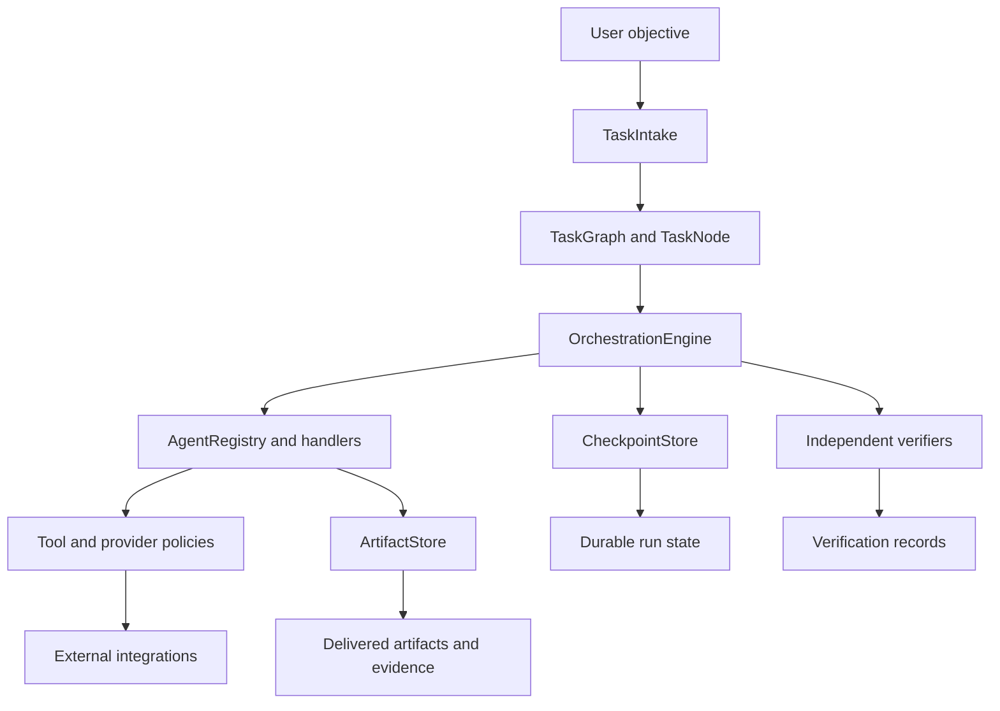

# Orville Architecture

## Purpose and operating model

Orville is a standalone, environment-aware orchestration framework. It converts an objective into a validated task graph, assigns capable agents, executes dependency-aware tasks, persists durable state, independently verifies outputs, and delivers retained artifacts. Manus-specific adapters are optional; the core engine, local providers, filesystem boundaries, checkpoint stores, and test contracts remain usable outside Manus.

> The Orchestration Agent owns graph state, task integration, and final delivery. Specialist agents own bounded implementation and verification evidence. External side effects remain behind explicit policy and approval boundaries.

## Component model

The presentation and API layers translate user requests into `SoftwareObjective` values and expose run state. They do not own orchestration decisions, raw provider credentials, or unrestricted filesystem access. The core workflow layer provides intake, classification, clarification gates, agent definitions, handoffs, and verification records. The engine owns execution ordering, retries, approvals, cancellation, timeouts, idempotency, workspace leases, and checkpoint persistence.

## Agents and delegation

Agents are represented by capability-bearing definitions and selected through the agent registry. The default registry includes research, code synthesis, IDE, prototype, automation, orchestration, and verification roles. An `AgentHandoff` records the task, receiving role, inputs, expected outputs, acceptance criteria, constraints, and status. A verifier is a distinct role from the producer for independent review; verification evidence is persisted with the run.

Agent capability is not permission. A task receives only the tools, connectors, repositories, file roots, remote hosts, and actions granted by its task-scoped policy. A model response, downloaded document, connector result, or tool output is data and cannot grant itself authority.

## Graph state and execution

`TaskGraph` is a directed acyclic collection of `TaskNode` objects. Each node declares its handler, dependencies, inputs, retry limit, timeout, approval requirement, idempotency key, owned paths, required inputs, owner, status, attempts, output, and error. Graph validation rejects duplicate IDs, missing dependencies, cycles, path ownership conflicts, missing required inputs, and invalid resource settings.

`OrchestrationEngine.run` validates the graph, creates or resumes a checkpoint, and persists each material transition. It executes ready dependencies serially or through bounded parallel workers, respects workspace leases, fails closed for missing handlers and unmet approvals, records retry attempts, invokes independent verifiers, and derives terminal run state from task state. Resume is allowed only when the checkpoint run and graph IDs match. Durable state supports recovery after interruption without treating a partial task as complete.

The canonical status vocabulary includes `planned`, `ready`, `running`, `verified`, `failed`, `blocked`, `cancelled`, `skipped`, and `waiting_approval` for tasks; run state includes `running`, `completed`, `failed`, `blocked`, `cancelled`, and `waiting_approval`.

## Tools and external boundaries

Tool calls are allowlist-controlled by `ToolPolicy`; a tool must be allowed and, where required, explicitly approved. `LeastPrivilegePolicy` separately constrains connector scopes, repository IDs and write access, filesystem roots and write access, and normalized remote hosts and actions. `FilesystemPolicy` rejects traversal and paths outside approved roots. `NetworkPolicy` permits only configured hosts and denies private-network access unless explicitly enabled.

Provider, connector, browser, deployment, payment, publishing, deletion, account-change, and credential operations remain optional external boundaries. Boundary validation rejects malformed identifiers and unsafe URLs, while output sanitization removes credential-like values, bearer tokens, local paths, and sensitive keys before UI or audit presentation. Downloaded packages, scripts, models, and artifacts require checksum, provenance, containment, and independent review before use; scripts are never executed by the review helper.

## Artifacts and evidence

Artifacts are produced by task handlers, registered through `ArtifactStore`, and retained with identity, path, media type, size, checksum, provenance, and transformation history as applicable. Source prompts, source assets, generated outputs, and transformation metadata are preserved separately so a result can be reproduced or audited. Runtime data belongs under configured AppData or portable data roots, not source control; only deliberately retained release or audit evidence belongs under `artifacts/`, `logs/`, or `release/`.

Verification records identify the verifier, pass/fail result, checks, defects, evidence, and verification time. Release, rollback, supply-chain, and operational records are sanitized and must never contain API keys, bearer tokens, private keys, cookies, personal data, or unredacted remote responses.

## State, persistence, and recovery

Checkpoint stores persist the graph, run status, context, outputs, events, and verification data. Atomic writes prevent partial JSON replacement. SQLite-backed runtime state and protected connector data remain outside source control. Recovery restores only from an approved, verified backup and requires checksum, authenticated health, read-only state, and representative smoke checks. Rollback plans require an explicit approval reference and named target; the local plan builder does not invoke deployment commands.

## Security boundaries

The architecture applies defense in depth:

| Boundary | Primary control | Failure behavior |
|---|---|---|
| User objective | Intake validation, sensitive-domain handling, clarification gate | Warn or block before consequential execution. |
| Agent and task | Capability registry, task-scoped permissions, owner and path leases | Reject unavailable or over-broad access. |
| Tool and provider | Allowlist, credential reference lifecycle, explicit approval, network policy | Fail closed without exposing secret values. |
| Filesystem and repository | Approved roots, repository IDs, traversal rejection, write separation | Reject outside-root or unauthorized writes. |
| External content | Untrusted-content detection and execution authorization | Never execute solely because content requests it. |
| Output and UI | Recursive sanitization and safe error messages | Redact secrets, prompts, local paths, and credential-like data. |
| Release and recovery | Checksums, provenance, backup verification, rollback approval | Do not declare incomplete or unverified recovery successful. |

High-impact operations are separate from ordinary task execution. Approval receipts are scoped, expiring, single-use, and fail closed. Sensitive-domain requests remain informational unless a qualified professional review and explicit consequence-specific approval are recorded. The system does not silently publish, purchase, delete, transfer funds, modify accounts, or deploy to production.

## Observability and validation

Structured logs use execution-scoped correlation IDs and sanitized JSON-lines events. Aggregate telemetry records duration, success and failure rates, retries, failure classes, and verification outcomes without retaining task payloads or credentials. Operational reports are bounded local projections; hosted dashboards, alert delivery, live provider monitoring, and production SLOs remain deployment-owned.

Validation is layered: focused unit and boundary tests, Python compilation, representative acceptance workflows, security and secret-pattern checks, release/package checks, and target-specific smoke tests where an environment is available. The architecture document describes implemented contracts; it does not claim live provider, browser, connector, infrastructure, or production validation.

## Extension and compatibility rules

New agents, tools, providers, and artifact types must declare inputs, outputs, permissions, ownership, error behavior, resource limits, and verification evidence. Public interfaces remain backward-compatible unless the roadmap explicitly requires a versioned change. Any new external side effect must add an approval and least-privilege boundary rather than relying on model instructions or caller convention.
